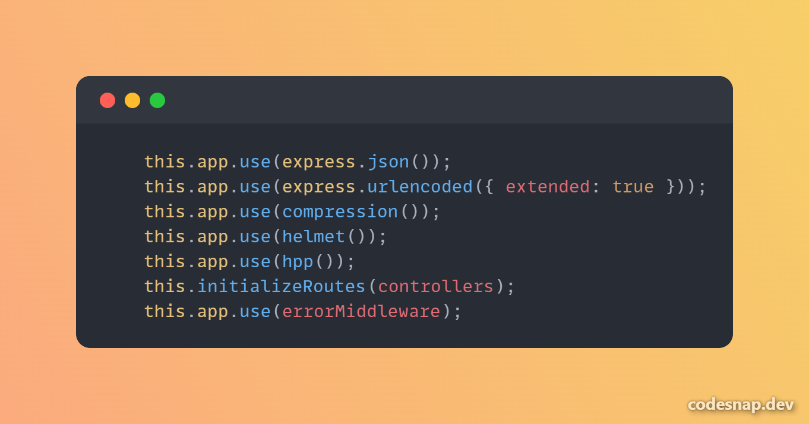
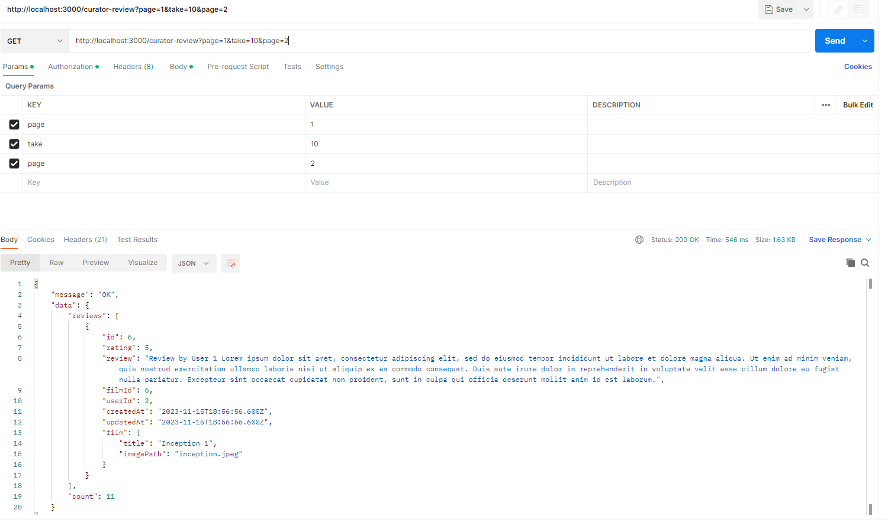
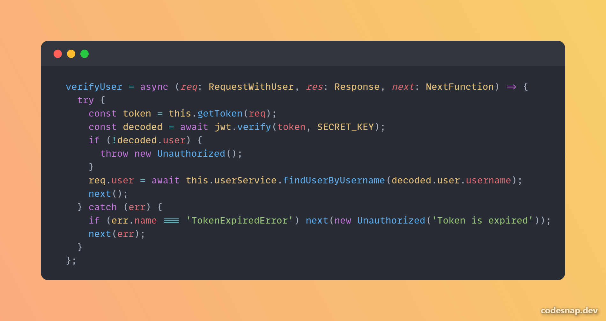

# BNMOBOXD REST SERVICE
BNMOBOXD REST Service is a backend service for [BNMOBOXD - Curators](https://gitlab.informatika.org/if3110-2023-01-16/bnmoboxd-spa-client). This Service provides backend for handling Curators' Authentication, Reviews Creation, and Subscription Management. This Service is built with Expressjs and uses postgresql database along with Redis for caching.

This service should be used along with:
- [BNMOBOXD SOAP](https://gitlab.informatika.org/if3110-2023-01-16/bnmoboxd-soap-service)
- [BNMOBOXD App](https://gitlab.informatika.org/if3110-2023-01-16/bnmoboxd)

## Features
This service provides the following API endpoints
| METHOD | ENDPOINT                      | ROLE    |
|--------|-------------------------------|---------|
| POST   | /auth/login                   | public  |
| POST   | /auth/register                | public  |
| GET    | /curator                      | admin   |
| GET    | /curator/:id                  | admin   |
| GET    | /curator-review               | curator |
| GET    | /curator-review/:id           | curator |
| POST   | /curator-review               | curator |
| PUT    | /curator-review/:id           | curator |
| DELETE | /curator-review/:id           | curator |
| GET    | /film                         | public  |
| GET    | /subscription                 | admin   |
| PUT    | /subscription                 | admin   |
| GET    | /user-verification            | admin   |
| PUT    | /user-verification/:id/verify | admin   |
| PUT    | /user-verification/:id/reject | admin   |

## Requirements
1. Docker

## Installation
1. Install requirements
2. Clone repository
3. By default, this app uses port `3000, 8003, 6379` but it can be modified through `docker-compose.yml`.

## Running Application
1. `cd` to repository's root
2. Make a env file `.env.production`
3. Fill the file `.env.production` referring to `env.example`, make sure to include the correct endpoint for the other services
4. Open terminal and run `docker compose up -d`

## Task
| 13521044                     | 13521047                                 | 13521107                     |
|------------------------------|------------------------------------------|------------------------------|
| Curator Review CRUD          | User Verification Service and Controller | Get subscriptions from SOAP  |
| GET films from PHP           | Review and Testing                       | Update subscriptions on SOAP |
| Auth                         |                                          | Review and Testing           |
| Project Initialization       |                                          |                              |
| Middlewares                  |                                          |                              |
| Error Handling               |                                          |                              |
| Docker                       |                                          |                              |
| User Verification Repository |                                          |                              |
| PHP Client                   |                                          |                              |
| SOAP Client                  |                                          |                              |
| Upload Profile Picture       |                                          |                              |
| Edit Profile                 |                                          |                              |

## Bonus
1. Docker
2. Redis Cache

## Authors
|              Nama              |   NIM    |
| :----------------------------: | :------: |
| Rachel Gabriela Chen           | 13521044 |
| Muhammad Equilibrie Fajria     | 13521047 |
| Jericho Russel Sebastian       | 13521107 |

## OWASP
**1. HTTP Parameter Pollution**
This app is secure from `HTTP Parameter Pollution` Attack. 
HPP (HTTP Parameter Pollution) is a vulnerability that arises when multiple values are assigned to the same parameter in an HTTP request, leading to unexpected behavior in the application. This can occur due to the way the application processes and interprets the input parameters.

This service uses the library `hpp` to prevent HPP attack.

In the image below, the service only reads the last parameter for `page` which is 2

**2. JWT Attack**
This app is secure from `JWT Attack`. JWT injection occurs when an attacker manipulates the content of a JWT to tamper with the claims or inject additional data. For example, an attacker might modify the user ID claim to impersonate another user. There are other types of JWT Attack as well, such as Brute Force etc.

This app uses:
1. JWT verify to authenticate user instead of JWT decode
2. Hashed secret key that can't be brute forced

